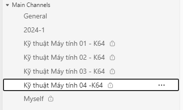

# CÔNG CỤ HỖ TRỢ MICROSOFT TEAMS

## Tạo Teams, bổ sung thành viên

 
 

## Tải về

Tải về file chạy duy nhất x86_64: <https://github.com/neittien0110/MSTeamsTools/releases/download/1.0.0/CreateTeam.exe>\
Tải về toàn bộ file chạy và mã nguồn: <https://github.com/neittien0110/MSTeamsTools/releases/tag/1.0.0>

### Mô tả chức năng ###

1. Tạo team mới, hoặc tái sử dụng Team cũ thông qua **Link Team** cũ.
2. Bổ sung thêm hoặc có thể bỏ qua **Co-Owner** đồng sáng lập cho Team đã chỉ định.
3. Đưa vào **danh sách các thành viên**, hoặc dưới dạng file text, hoặc điền trực tiếp trong cửa sổ InputBox.
4. Bổ sung thêm tên **Private Channel** nếu muốn, hoặc bỏ qua và kết thúc.
    Trường hợp tên **Private Channel** đã tồn tại thì công cụ sẽ tải sử dụng **Private Channel** cũ.
5. Bổ sung chính danh sách thành viên đã chỉ định ở trên vào **Private Channel**. 

> Công cụ này còn cho phép tạo **private channel** và bổ sung chính các thành viên đó cho **private channel**

### Cú pháp ###

Cú pháp:

```ps
 CreateTeam.exe [[-TeamName] <String>] [[-TeamLink] <String>] [[-CoOwner] <String>] [[-UserFile] <String>] [[-ChannelName] <String>] [<CommonParameters>]
```

hoặc

```ps
 .\CreateTeam.ps1 [[-TeamName] <String>] [[-TeamLink] <String>] [[-CoOwner] <String>] [[-UserFile] <String>] [[-ChannelName] <String>] [<CommonParameters>]
```

### Hướng dẫn sử dụng nhanh ###

Công cụ hỏi sẽ hỏi đáp trên giao diện console. Trả lời tuần tự là xong.

```ps
> CreateTeam.exe 
```

Tạo một Teams mới có tên là **IT3030 - HK2024.1**, với danh sách thành viên nằm trong file **students.demo.txt**, và một trợ lý/trợ giảng có tài khoản là **ndt@hust.edu.vn**

```ps
> CreateTeam.exe -TeamName "IT3030 - HK2024.1" -CoOwner ndt@hust.edu.vn -UserFile students.demo.txt
```

Bổ sung vào Teams sẵn có tên là **Quản lý lớp**, với danh sách thành viên nằm trong file **students.demo.txt**, và đồng thời tất cả thành viên này vào một Private Channel có tên là **Lớp KTMT06-K70**

```ps
> CreateTeam.exe -TeamName **Quản lý lớp** -ChannelName "Lớp KTMT06-K70" -UserFile students.demo.txt
```

Bổ sung vào Teams sẵn có qua Link **Get link to team**, với danh sách thành viên trong file **students.demo.txt**

```ps
> CreateTeam.exe -TeamLink "https://teams.microsoft.com/l/team/19%3Ac413f762004341f3b69d9fd6bb28aa0b%40thread.tacv2/conversations?groupId=ccdb66b9-449d-446d-a2bd-7f21199fe859&tenantId=06f1b89f-07e8-464f-b408-ec1b45703f31"  -UserFile students.demo.txt
```


### Hướng dẫn sử dụng trong Commandline ###

```ps
NAME
    E:\workspaces\OfficeTools\MSTeamsTools\CreateTeam.ps1

SYNOPSIS
    Tao MSTeam moi, hoac su dung lai Team cu. Dong thoi bo sung them thanh vien vao Team do.Tao MSTeam moi, hoac su dung lai Team cu. Dong thoi bo sung them thanh    
    vien vao Team do.


SYNTAX
    .\CreateTeam.ps1 [[-TeamName] <String>] [[-TeamLink] <String>] [[-CoOwner] <String>] [[-UserFile] <String>] [[-ChannelName] <String>] [<CommonParameters>]


DESCRIPTION
    - TeamName  Ten cua Team. Neu co ki tu space, hay dat trong dau "". Neu tham so TeamLink duoc khai bao, TeamName se bi bo qua.
    - TeamLink  GroupID cua Team cu da ton tai. De xem GroupID cua Team cu, hay vao Team va dung chuc nang <Get link to team> de lay URL co dang
    https://teams.microsoft.com/l/team/...  
    - CoOwner   Bo sung them 1 thanh vien sang lap owner. Vi du hoa.lt241234567@sis.hust.edu.vn
    - UserFile  Duong dan toi file danh sach chua cac thanh vien. Email cua moi thanh vien tren mot dong. Vi du
                tien.nguyen123@hust.edu.vn
                hoa.le456@hust.edu.vn
    Huong dan chi tiet: https://neittien0110.github.io/MSTeamsTools/


RELATED LINKS
    GitHub: https://github.com/neittien0110/msteamstools

    Get commandline params

REMARKS
    To see the examples, type: "get-help E:\workspaces\OfficeTools\MSTeamsTools\CreateTeam.ps1 -examples".
    For more information, type: "get-help E:\workspaces\OfficeTools\MSTeamsTools\CreateTeam.ps1 -detailed".
    For technical information, type: "get-help E:\workspaces\OfficeTools\MSTeamsTools\CreateTeam.ps1 -full".
    For online help, type: "get-help E:\workspaces\OfficeTools\MSTeamsTools\CreateTeam.ps1 -online"   
```
